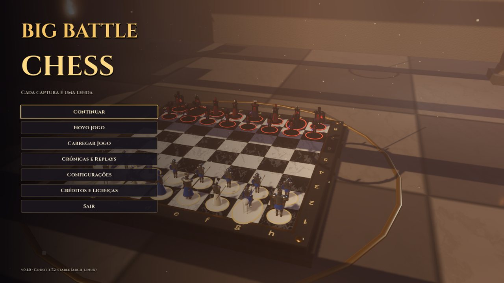
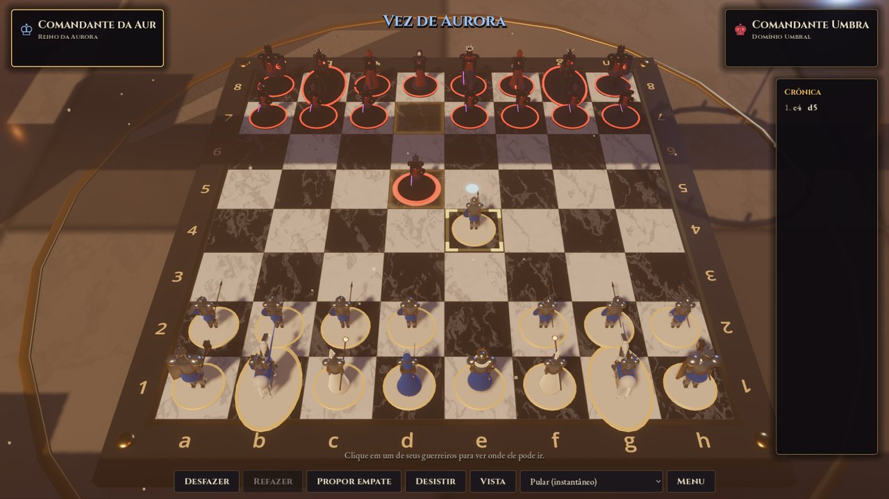
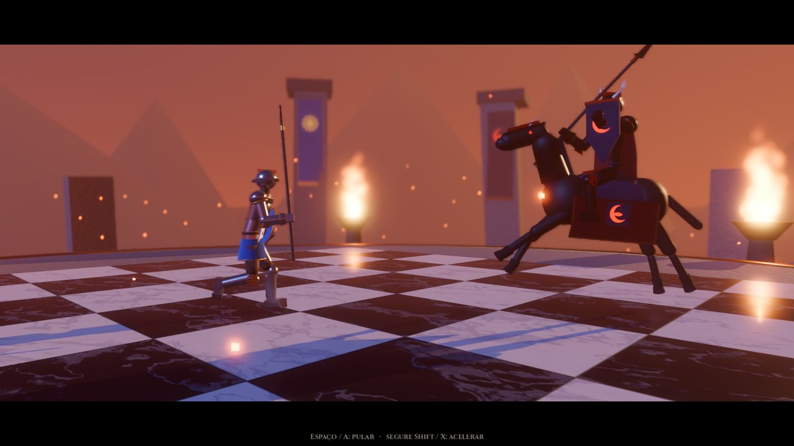
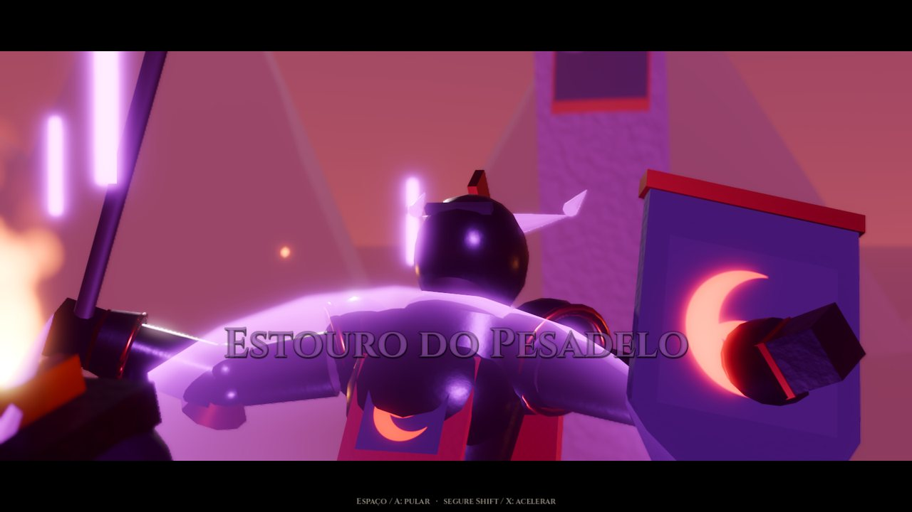

# Big Battle Chess

**Real chess, staged as medieval battles.** Big Battle Chess is an original 3D chess game made with **Godot Engine 4.7.2**. Every piece is an animated warrior of one of two armies, the **Kingdom of Dawn** (White) and the **Umbral Dominion** (Black). Every capture can be shown as a cinematic duel in the *Arena of Fate*.

The chess comes first. A complete, tested rules engine decides every move before any animation starts. The animation never decides who wins: if a pawn takes a queen, the pawn wins the duel.



| Board | Arena battle | Finishing technique |
|---|---|---|
|  |  |  |

> **Status: early playable build (v0.1.0).** It is a complete, playable game, but it is not yet AAA quality. Characters, arenas and effects are built procedurally from primitives as an original stand-in art set. See [Roadmap](docs/ROADMAP.md) for what is done and what comes next.

## Features (implemented)

**Chess**
- Full FIDE rules, verified by perft on 7 reference positions:
  - castling, en passant, promotion with all four choices
  - check, checkmate and stalemate
  - insufficient material, threefold (claim) and fivefold (automatic) repetition, 50-move (claim) and 75-move (automatic) rules
- Resignation, draw offers, optional chess clock with Fischer increment.
- Undo/redo, autosave, save slots, FEN, PGN (export/import) and SAN.

**Opponents**
- Local two-player, Player vs AI, and **watch AI vs AI**.
- Six AI levels from Beginner to Grandmaster. The built-in engine is an alpha-beta search with iterative deepening, transposition table, quiescence, null move, LMR and killer/history ordering. It runs on a worker thread and thinks *during* cinematics.
- **Grandmaster** uses Stockfish over UCI if it is installed on your system. Stockfish is never bundled.

**Battles**
- Five presentation modes: **Epic** (30–50 s), **Dynamic** (10–20 s), **Quick** (3–6 s), **Classic** (a short strike on the board) and **Skip**. Battles can be sped up (hold Shift) or skipped (Space).
- Data-driven choreography: per-class combat profiles combine into battles that differ for every attacker/defender pair. Examples: exchanges, dashes, leaps, blade locks, spell volleys and cavalry charges, plus one finishing technique per class.
- Cinematic camera: orbit, over-the-shoulder, low and high angles, close-ups, dutch angle, projectile follow, impact zoom, depth of field, contextual shake, slow motion and hit-stop. The camera avoids clipping into fighters.
- Special titles for legendary captures (pawn vs queen), en passant, heroic promotion and checkmate. On checkmate the king surrenders; it is never captured.

**World**
- 6 classes × 2 factions of articulated warriors: footman, mounted lance knight, war cleric, bastion guardian, queen and king. Each has its own armour, weapons, capes and emblems.
- 7 board themes and 4 battlefields (Royal Hall, Shadow Fortress, Cathedral of Light, Ruins at Dawn), with volumetric light, fire, banners and dust.
- Graphics presets Low → Cinematic: SSAO/SSIL, SSR, SDFGI, volumetric fog, TAA/MSAA, FSR/FSR2 scaling.

**Interface and audio**
- Dark-fantasy UI. Mouse, keyboard and gamepad are all supported.
- Accessibility: camera shake, reduced flashes, reduced motion, particle intensity, UI scale.
- English and Brazilian Portuguese.
- Original synthesized orchestral-style music, ambience and sound effects. Six audio buses with separate volumes.

## Requirements

- **Godot 4.7.2 stable**, standard build (no .NET needed).
- A Vulkan-capable GPU for the Forward+ renderer. Tested on an AMD Radeon RX 9060 XT (Mesa RADV).
- Linux or Windows. On BigLinux/Manjaro: `sudo pacman -S godot`.

## Run

```bash
git clone https://github.com/ruscher/big-battle-chess.git
cd big-battle-chess
godot --path . --import   # first time only: imports assets and translations
godot --path .            # play
```

You can also open `project.godot` in the Godot editor and press **F5**.

## How to play

1. **New Game.** Choose your opponent, army, AI level, battle mode, board, battlefield and clock.
2. **Click one of your warriors.** Glowing dots are moves, red rings are captures and the gold frame marks the selection.
3. **Click a destination.** If it's a capture, watch the battle, or press **Space** to skip it.

| Action | Mouse / keyboard | Gamepad |
|---|---|---|
| Select / move | Left click, Enter, Space | A |
| Board cursor | Arrow keys | D-pad / left stick |
| Rotate / tilt camera | Right drag, Q/E, R/F | Right stick |
| Zoom | Wheel, + / − | Triggers |
| Reset camera | C | R3 |
| Skip / speed up battle | Space / hold Shift | A / hold X |
| Undo | U | Back |
| Pause menu | Esc | Start |

## Tests

```bash
godot --headless --path . --script res://tests/run_tests.gd          # rules, perft, AI, choreography
godot --headless --path . --script res://tests/run_tests.gd -- --deep # adds deeper perft counts
godot --headless --path . res://tests/integration_test.tscn          # plays the real game scene end to end
```

What is covered and the latest results are in [docs/TESTING.md](docs/TESTING.md).

## Project layout

```
scripts/core/chess   rules engine (no scene dependencies)
scripts/ai           evaluation, search, AI player, UCI client
scripts/gameplay     session state machine, move presenter, saves, config
scripts/combat       choreographer, timeline, battle director, arena, VFX
scripts/characters   procedural warriors, horse, gear
scripts/animation    pose library and animator
scripts/board, camera, environment, ui, audio, graphics, app
shaders/             board, cloth, emblem, highlight, energy, slash trail
assets/              fonts (OFL) and generated audio
tests/               unit suites, perft, integration scene
tools/               audio and translation generators, character gallery
docs/                architecture and design documentation
```

## Documentation

- [Architecture](docs/ARCHITECTURE.md)
- [Chess engine and AI](docs/CHESS_ENGINE.md)
- [Combat and cinematic system](docs/COMBAT_SYSTEM.md)
- [Character pipeline](docs/CHARACTER_PIPELINE.md)
- [Performance](docs/PERFORMANCE.md)
- [Testing](docs/TESTING.md)
- [Asset licenses](docs/ASSET_LICENSES.md)
- [Roadmap](docs/ROADMAP.md)

## Contributing

Issues and pull requests are welcome. Please:
- Keep chess logic in `scripts/core` free of scene, animation and UI code.
- Run both test commands before opening a PR.
- Add new UI text to `tools/translations_source.py` and regenerate the CSV.
- Check the license of any asset you contribute and record it in [docs/ASSET_LICENSES.md](docs/ASSET_LICENSES.md).

## License

- **Code, shaders, procedural art and generated audio:** MIT, see [LICENSE](LICENSE).
- **Fonts:** Cinzel and EB Garamond, SIL Open Font License 1.1 (`assets/fonts/*-OFL.txt`).

No third-party models, textures or audio are included. Details are in [docs/ASSET_LICENSES.md](docs/ASSET_LICENSES.md).

## Credits

Created for the Big Battle Chess project, built with [Godot Engine](https://godotengine.org) (MIT). It is inspired by the classic idea of animated chess battles. No code or assets from other games were used.

---

### Resumo em português

**Big Battle Chess** é um jogo de xadrez 3D original feito na Godot 4.7.2. As peças são guerreiros medievais animados, e cada captura pode virar uma batalha cinematográfica. O motor de xadrez segue as regras oficiais completas e é validado por testes *perft*. O resultado de cada jogada é sempre decidido pelo xadrez, nunca pela animação.

Para jogar, rode `godot --path . --import` uma vez e depois `godot --path .`. A interface está disponível em português e inglês.
